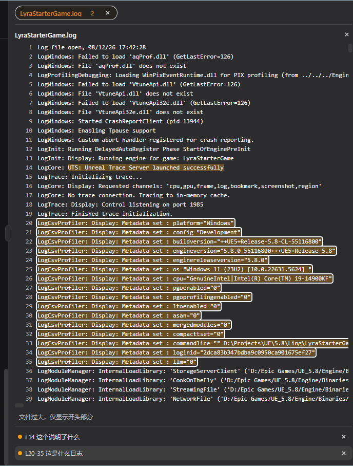

# dir-tree-dsh

DeepSeek Harness（dsh）Web GUI 的**侧边栏文件树插件**：在懒加载展开的树里浏览工作区的真实文件，每行显示 git 状态着色，按文件名就地过滤搜索，并可多选文件让模型知晓。

[English](README.md) | [中文](README.zh.md)



## 特性

- **懒加载、有界列举** — 每个展开层级一次 `listDir` 调用，至多 `maxEntries`（默认 1000）条并带 `truncated` 标志。
- **每行 git 着色** — 文件报自身状态（`modified` / `added` / `deleted` / `untracked` / `ignored`）；目录聚合其下任意深度后代的最高等级状态，树深处的改动会把每一层包围目录都染上色。
- **选择对模型可见** — 多选路径落为持久化的 `file/selection` 会话事件，渲染进模型上下文，并可从会话日志回放重建。
- **免轮询实时刷新** — Chokidar 监听器发出 `filetree/change`，经 dsh 的 remote-event 白名单转发到客户端；客户端中止被取代的请求并重列已展开视图。
- **树内文件搜索** — 树上方搜索框按文件名（忽略大小写子串，文件与目录都算）过滤，同时保留树形：匹配项沿合成的祖先链自动展开显示，匹配行保留 git 着色（合成的祖先行不着色）。清空查询恢复普通树；点击匹配目录清除过滤并在普通树中定位展开该目录。
- **右键菜单** — 右键任意行弹出菜单：`默认程序打开`、`复制文件/文件夹路径`；对文本文件还有 `文件编辑标记`。
- **文件编辑标记** — 右侧边栏编辑器（按语言 shiki 语法高亮）里划选文本，弹出说明框告诉模型要对这段文字做什么；可标记多个段落、多个文件，标记可删除。每个已标记文件在右侧折叠成一个 tag（挂起为琥珀色，完成转绿）。标记以持久化 `file/annotation` 会话事件落日志并渲染进模型上下文；当模型的 `write`/`edit` 工具改动该文件时，对应标记自动转为 `done`。
- **为大仓库加固**（在真实 monorepo 上实测）：
  - git-status 扫描按仓库根单飞、按截止时间终止（`gitStatusTimeoutMs`，默认 8 秒）；到期时列举无着色地落定而非卡死。
  - `--ignored` 默认关闭（`gitStatusIncludeIgnored` 可选开启）：实测开启后一次扫描 >5 分钟，关闭仅 0.06 秒。
  - 监听器设 `followSymlinks: false`（pnpm 的 `node_modules` 是通向虚拟存储的 junction）并经编译后的 glob 匹配器跳过 `node_modules` / `.git` / `.pnpm-store`（chokidar 5 对字符串 `ignored` 项做精确相等比较，只有编译成 glob 才真正剪枝）。
  - 优雅降级：无 git 仓库、缺 `git` 或输出溢出只意味着不着色，绝不导致列举失败。

## 仓库结构

```
packages/
├── host/
│   ├── file-tree/          # Service Definition：ctx.fileTree、listDir、契约类型
│   └── file-tree-local/    # 后端：目录列举、git status、Chokidar 监听
├── client/
│   └── ui-file-tree/       # 浏览器树 UI：展开、git 着色、名称搜索、多选
└── context/
    └── file-selection/     # 选择 → 持久会话事件 → 模型上下文
integration/
├── wiring.patch            # dsh 核心接线改动（RPC、侧边栏槽位、事件转发）
└── new-files/              # 补丁引入的 dsh 核心新文件
docs/
├── screenshot.png                              # 本 README 所用的界面截图
└── 2026-08-14-file-tree-capability-seam.md     # 完整设计记录（中英双语）
```

插件包使用 pnpm `workspace:^` 依赖，设计为放在 **dsh 工作区内部**运行。`integration/` 携带插件所需的 dsh 核心接线（apiproxy 的 `filetree.list`/`filetree.select`/`filetree.search` RPC、`sidebar.filetree` 槽位与"工作区/文件"切换、`filetree/change` 事件转发白名单、web-app 挂载行）。

## 安装到 dsh 工作区

要求：[dsh](https://github.com/deepseek-harness) 一份检出、Node 22+、pnpm。

1. **复制插件包**到 monorepo 的对应路径：

   ```
   packages/host/file-tree
   packages/host/file-tree-local
   packages/client/ui-file-tree
   packages/context/file-selection
   ```

2. **应用接线改动**（在仓库根目录执行）：

   ```bash
   git apply integration/wiring.patch
   cp -r integration/new-files/* .
   ```

   `wiring.patch` 是相对本插件开发时那份 dsh 检出的核心改动快照；在更新的 dsh 上需手动解决冲突。

3. **安装**（更新 lockfile 并链接新 workspace 包）：

   ```bash
   pnpm install
   ```

4. **刷新受影响的测试快照**（`apps/web` 与 `ui-sidebar` 的 UI 快照）：按 dsh 测试文档用 `-u` 跑对应套件。

5. **运行**：`pnpm dsh web`，然后打开侧边栏的"文件"标签。

## 配置项

`LocalFileTree`（`packages/host/file-tree-local` 后端）接受 cordis 配置 schema：

| 键 | 默认值 | 含义 |
|---|---|---|
| `maxEntries` | `1000` | 单个列举层级的完整结果上限 |
| `graceMs` | `5000` | git 进程终止升级的宽限期 |
| `gitStatusMaxBytes` | `8 MiB` | stdout 上限；溢出降级为不着色 |
| `gitStatusIncludeIgnored` | `false` | 扫描加 `--ignored`（monorepo 上很慢；按需开启） |
| `gitStatusTimeoutMs` | `8000` | 单次扫描截止时间；到期降级为不着色 |
| `usePolling` | `false` | 轮询式监听（无原生事件的网络盘） |
| `watchPollIntervalMs` | `500` | `usePolling` 为 true 时的轮询间隔 |
| `watchIgnored` | `['**/node_modules/**', '**/.git/**', '**/.pnpm-store/**']` | 监听器跳过的 glob（段内 `*`，跨段 `**`） |
| `watchDepth` | `undefined` | 挂载监听器的最大目录深度；undefined = 全深度 |
| `searchMaxMatches` | `200` | 单次搜索的匹配上限；超出置 `truncated` |
| `searchTimeoutMs` | `10000` | 单次搜索截止时间；到期以已收集的匹配落定（`truncated`） |
| `readMaxBytes` | `524288` | 编辑标记面板单次读文件的上限；更大的文件只返回带 `truncated` 的前缀 |

## 设计裁定（摘要）

- 树是 **GUI 浏览界面**，不是模型的存储工具：它像 dsh 的 directory-picker browse 后端一样直接读宿主文件系统，且返回文件（picker 只列目录），因为树要展示文件。完整记录见 [`docs/`](docs/2026-08-14-file-tree-capability-seam.md)。
- 实时更新走 **转发事件白名单**（`filetree/change`），不新增帧；客户端只重列已展开层级。
- 选择**按会话且落日志** — prompt 上下文从日志读回最新 `file/selection` 事件，绝不读客户端状态，因此回放重建同一上下文。
- 目录 git 色为**聚合态**：后代中按 `modified > added > deleted > untracked > ignored` 取最高等级。
- 搜索**仅文件名且在树内就地过滤**：对文件与目录名做忽略大小写子串匹配；客户端从宿主的扁平匹配列表重建树形，合成祖先目录（不着 git 色——从未被列举过）。宿主自行限制匹配数与时间（`searchMaxMatches`/`searchTimeoutMs`），因为客户端 30 秒 unary 超时不是深度遍历的合适兜底；合成链天然展开，点击目录行清除过滤并在普通树中定位。

## 测试

在装有这些包的 dsh 工作区里：

```bash
pnpm vitest run host/file-tree-local client/ui-file-tree
```
